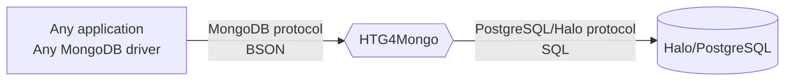

# Halo Transparent Gateway for MongoDB (aka HTG4Mongo)

HTG4Mongo is an transparent proxy, converting the MongoDB 5.0+ wire protocol queries to SQL -
using PostgreSQL or Halo as a database engine.

HTG4Mongo is based on the greate project FerretDB.

## Why do we need HTG4Mongo?

MongoDB was originally an eye-opening technology for many of us developers,
empowering us to build applications faster than using relational databases.
In its early days, its ease-to-use and well-documented drivers made MongoDB one of the simplest database solutions available.
However, as time passed, MongoDB abandoned its open-source roots;
changing the license to [SSPL](https://www.mongodb.com/licensing/server-side-public-license) - making it unusable for many open source and early-stage commercial projects.

Most MongoDB users do not require any advanced features offered by MongoDB;
however, they need an easy-to-use open-source document database solution.
Recognizing this, HTG4Mongo is here to fill that gap.
